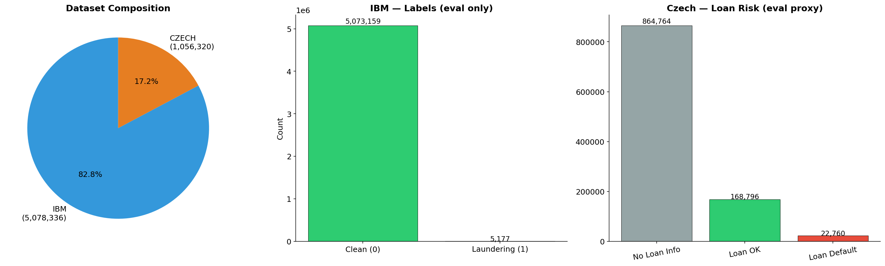
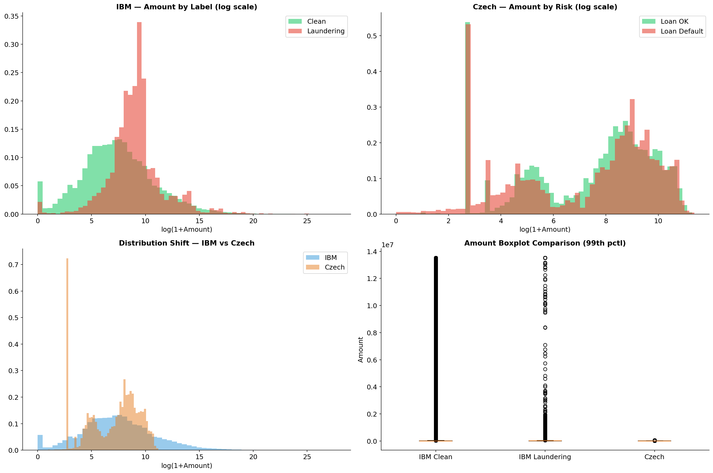
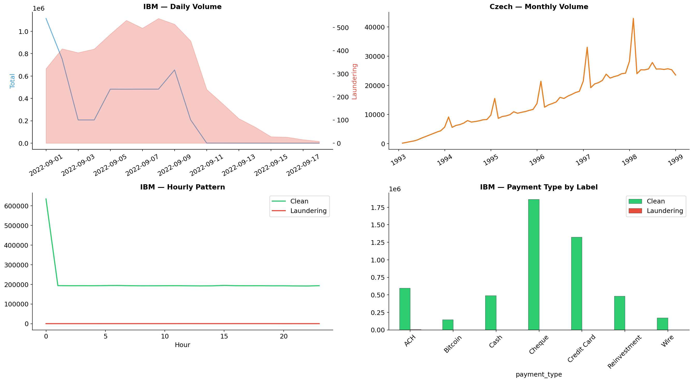
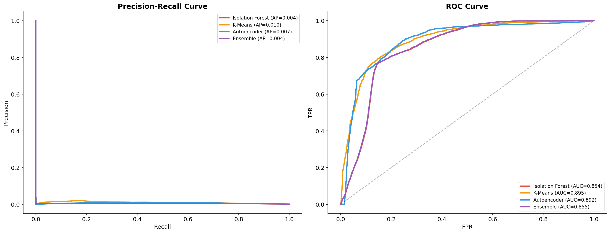
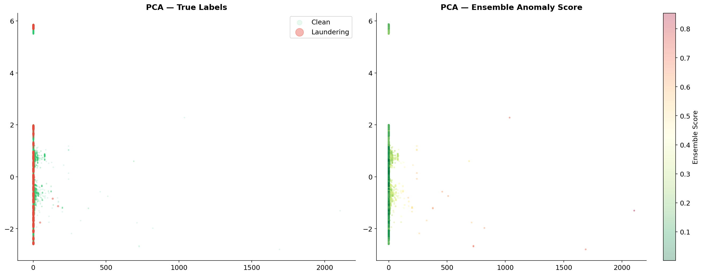

# AML Risk Detection

A machine learning project for anti-money laundering (AML) transaction risk detection using synthetic transaction datasets.

## What this repository contains
- Data loading and preprocessing pipelines (`src/preprocessing.py`)
- Supervised and unsupervised model training utilities (`src/models.py`)
- Evaluation and plotting helpers (`src/evaluate.py`)
- Notebooks for EDA, feature engineering, and model experimentation (`notebooks/`, `FInal_Project.ipynb`, `ds_final.ipynb`)
- Tests for preprocessing, models, and evaluation (`tests/`)

## Cleaned project structure
```text
AML/
├── src/
├── tests/
├── notebooks/
├── data/
├── reports/
│   ├── artifacts/   # model outputs (CSV/JSON)
│   └── figures/     # exported plots used in README
├── requirements.txt
├── environment.yml
└── README.md
```

## Results artifacts
Generated outputs are now organized in:
- `reports/artifacts/candidate_results.csv`
- `reports/artifacts/split_metrics.csv`
- `reports/artifacts/metrics.json`
- `reports/artifacts/top_alerts.csv`
- `reports/artifacts/false_positives.csv`
- `reports/artifacts/false_negatives.csv`

## Quick start
### 1) Install dependencies
Using pip:
```bash
pip install -r requirements.txt
```

Or using conda:
```bash
conda env create -f environment.yml
conda activate aml_proj
```

### 2) Run tests
```bash
pytest tests/ -v --tb=short --timeout=60
```

## Visualization gallery
### Dataset composition


### Amount distribution


### Temporal fraud pattern


### Model evaluation curves


### PCA projection view

