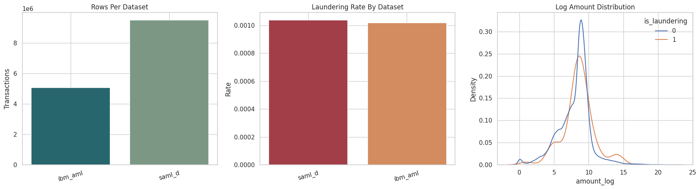
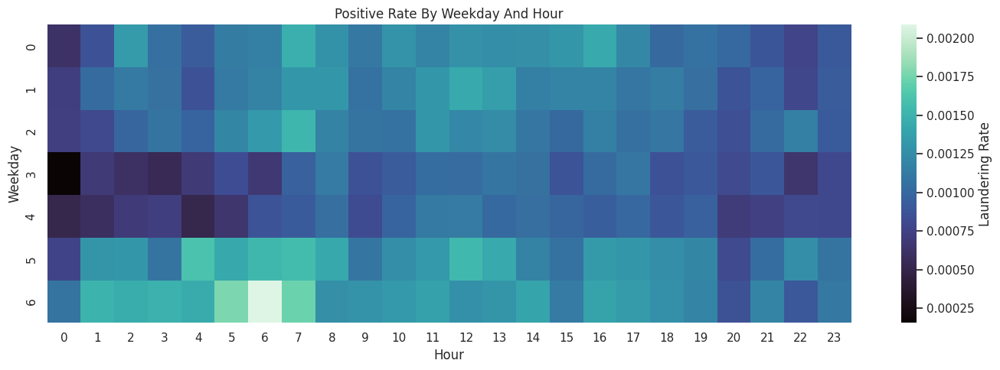
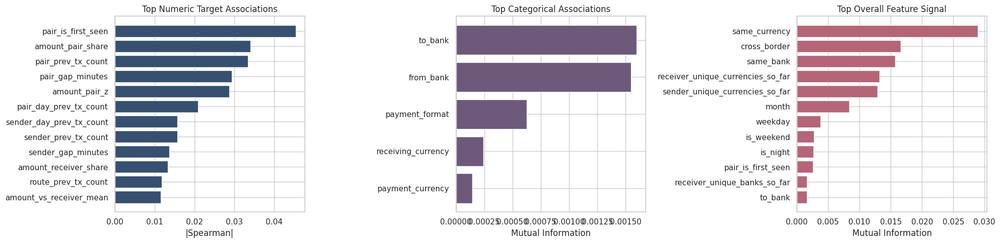
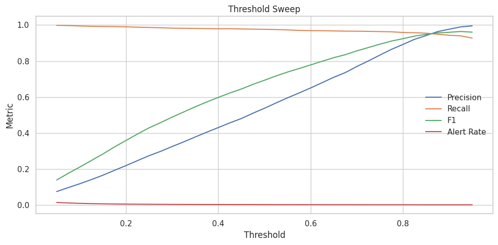
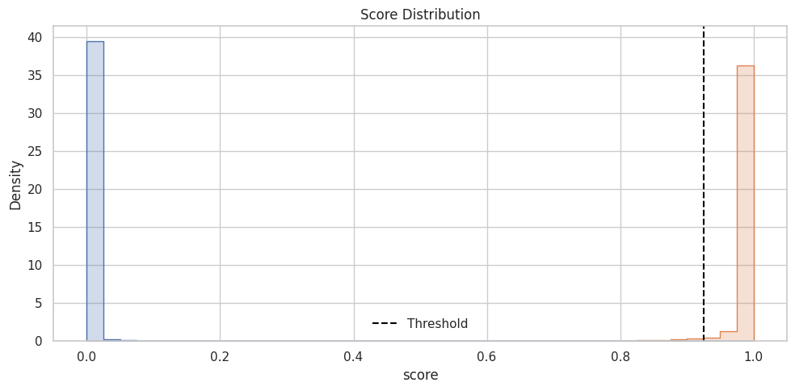
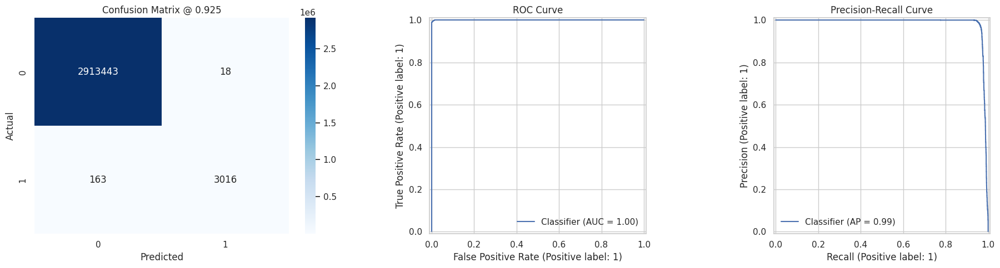

# AML Risk Detection with Merged IBM + SAML-D Data

Presentation video: add YouTube link here before the final submission.

This repository contains our BU CS 506 final project on anti-money laundering (AML) risk detection from transaction data. The final project story is centered on [ds_final.ipynb](ds_final.ipynb), which merges the IBM AML dataset and the SAML-D synthetic AML dataset, engineers leak-aware historical features, benchmarks several AML models, tunes alert thresholds, and exports final-quality figures and artifacts.

## Build And Run

Start here for both the April check-in and the final report.

### Option 1: `make` workflow

```bash
make all
make download
make reproduce
```

What each command does:

- `make all` installs the dependencies and runs the tests
- `make install` installs the Python dependencies from `requirements.txt`
- `make test` runs the repository test suite used by CI
- `make download` downloads the IBM AML and SAML-D datasets with `kagglehub` into `data/raw/`
- `make run` opens `ds_final.ipynb` in JupyterLab
- `make reproduce` executes the final notebook and saves an executed copy under `reports/`

### Option 2: Conda workflow

```bash
conda env create -f environment.yml
conda activate aml_proj
make all
make download
make reproduce
```

### Reproducing the final notebook results

1. Download the datasets with `make download`
2. Execute `make reproduce`
3. Open `ds_final.ipynb` or the executed notebook under `reports/` if you want to inspect outputs after the run

Notes:

- The full notebook is computationally heavy on the full datasets
- The notebook caches engineered features to parquet so repeated runs are much faster
- The exported CSV artifacts in `reports/artifacts/` and the figures in `reports/figures/` were produced from the final notebook outputs

## Repository Guide

```text
AML/
├── ds_final.ipynb              # final end-to-end notebook used for project results
├── Makefile                    # install / test / download / run helpers
├── data/
│   ├── download.py             # KaggleHub download helper for IBM AML + SAML-D
│   └── README.md               # dataset setup notes
├── reports/
│   ├── artifacts/              # exported metrics, alert samples, and result tables
│   └── figures/                # README-ready figures extracted from ds_final.ipynb
├── FINAL_CHECKLIST.md          # submission checklist for the final deadline
├── FINAL_PRESENTATION_PREP.md  # presentation outline and Q&A prep
├── src/                        # earlier modular AML experiments and utilities
├── tests/                      # lightweight CI smoke tests for src/
├── .github/workflows/ci.yml    # GitHub Actions test workflow
├── environment.yml
├── environment-ci.yml
└── requirements.txt
```

## Project Overview

Financial institutions process huge numbers of transactions and need to identify suspicious activity without overwhelming investigators with false positives. Our project studies AML detection as a transaction-ranking problem under extreme class imbalance.

The final pipeline combines two public synthetic datasets, standardizes them into a shared schema, builds transaction-history features that only use past information, and compares multiple tree-based classifiers plus an anomaly signal. The final goal is not just classification accuracy, but useful alert prioritization: can we push truly suspicious transactions to the top of the review queue?

## Project Goals

Our project goals are:

1. Detect suspicious transactions using structured transaction metadata and historical behavioral features
2. Compare multiple AML modeling approaches instead of trusting a single model family
3. Evaluate the model in a way that reflects AML operations, especially class imbalance and limited analyst review capacity
4. Produce interpretable visualizations that justify feature choices, model choices, and final alert thresholds

## April Check-In Snapshot

This section is the quickest summary for the April rubric.

### Data Visualizations

For the April check-in, the strongest visuals from the final notebook are:

- `temporal_patterns_final.png`: laundering rate by weekday and hour
- `feature_association_views_final.png`: which engineered features carry the strongest target signal
- `threshold_sweep_final.png`: precision/recall/F1 and alert-rate tradeoffs as the threshold changes
- `rank_diagnostics_final.png`: precision-at-k and lift-at-k for prioritized alerts

These plots support concrete claims:

- laundering behavior is not temporally uniform
- historical behavioral features carry stronger signal than raw metadata alone
- threshold choice is an operational decision, not just a modeling detail
- the model is useful for ranking the top alerts investigators should review first

### Data Processing

Current processing choices reflected in `ds_final.ipynb`:

- merge IBM AML and SAML-D into one unified transaction schema
- normalize text fields and coerce numeric amount fields
- parse and standardize timestamps
- drop rows without usable transaction amounts
- sort transactions chronologically
- build historical features from only prior transactions
- keep leak-prone columns such as `laundering_type` and `source_dataset` for auditing only, not training

### Modeling Methods

The final notebook benchmarks:

- regularized XGBoost
- recall-focused XGBoost
- undersampled XGBoost
- histogram gradient boosting
- balanced random forest
- extra trees
- a weighted ensemble of the best validation performers

It also appends an Isolation Forest anomaly score as an extra feature before supervised training.

### Results And Interpretation

The selected model is a weighted ensemble with the `best_f1` validation threshold of `0.925`.

Held-out test metrics from `reports/artifacts/split_metrics.csv`:

- ROC-AUC: `0.9999`
- PR-AUC: `0.9851`
- PR lift over prevalence baseline: `903.78x`
- Precision: `0.9941`
- Recall: `0.9487`
- F1: `0.9709`

Operationally, the ranking results are especially strong:

- the top `0.1%` of alerts have precision `0.9997`
- those top alerts recover `91.7%` of all positives in the test set

## Data Collection

### Final datasets

We use two public transaction datasets:

1. IBM Transactions for Anti Money Laundering (AML)
2. SAML-D synthetic transaction monitoring dataset for AML

We originally considered additional datasets earlier in the semester, but the final project centers on IBM + SAML-D. The Czech dataset was dropped from the final modeling story.

### Data sources

- IBM AML Kaggle listing: <https://www.kaggle.com/datasets/ealtman2019/ibm-transactions-for-anti-money-laundering-aml>
- SAML-D Kaggle listing: <https://www.kaggle.com/datasets/berkanoztas/synthetic-transaction-monitoring-dataset-aml>

### Data collection method

Dataset download is implemented in [`data/download.py`](data/download.py) using `kagglehub`. The script downloads each dataset and creates symlinks inside `data/raw/` so the repository has stable local paths without committing the raw data.

## Data Cleaning And Harmonization

The final notebook standardizes both datasets into a shared schema with the following key fields:

- `source_dataset`
- `timestamp`
- `from_bank`, `from_account`
- `to_bank`, `to_account`
- `transaction_amount`
- `amount_paid`, `amount_received`
- `payment_currency`, `receiving_currency`
- `payment_format`
- `transaction_type`
- `laundering_type`
- `is_laundering`

Main cleaning steps:

- text normalization for bank, account, currency, and payment-format fields
- numeric coercion for amount columns
- timestamp parsing with `errors="coerce"`
- missing-field backfilling so both datasets share the same schema
- chronological sorting before building cumulative features
- explicit removal of leak-prone training shortcuts such as `laundering_type` and `source_dataset`

Why these decisions make sense:

- they let us train one consistent pipeline across both sources
- they prioritize behavioral generalization over memorizing dataset-specific labels
- they keep the evaluation closer to how AML systems work in practice, where only past history should be available at scoring time

## Feature Extraction

The final notebook uses 5 categorical features and 53 numeric features, plus one appended anomaly score.

### Categorical features

- `from_bank`
- `to_bank`
- `payment_currency`
- `receiving_currency`
- `payment_format`

### Numeric feature families

- raw and transformed amounts
- time-of-day and calendar features
- same-bank, same-currency, and cross-border indicators
- sender, receiver, pair, and route transaction counts
- per-day behavioral counts
- prior mean and standard deviation of transaction amounts
- time gaps since previous related transactions
- novelty counts for counterparties, banks, and currencies
- first-seen flags
- amount z-scores and amount-share features

These features are designed to capture laundering patterns such as structuring, repeated pair behavior, unusual transaction size relative to history, and cross-border novelty.

## Modeling And Evaluation

### Evaluation strategy

The final notebook uses a chronological split:

- train: 64%
- validation: 16%
- test: 20%

This is important because AML is a time-ordered problem. Random splits would make it too easy for historical features to benefit from future context.

### Metrics

We emphasize metrics that matter under class imbalance:

- PR-AUC
- PR lift over baseline prevalence
- precision
- recall
- F1
- precision-at-k
- lift-at-k

ROC-AUC is still reported, but it is not the only metric because ROC can look overly optimistic when the negative class dominates.

### Candidate models

| Candidate | Validation PR-AUC | Validation F1 |
| --- | ---: | ---: |
| weighted ensemble | 0.9763 | 0.9642 |
| xgb_recall_focused | 0.9757 | 0.9608 |
| xgb_undersampled | 0.9748 | 0.9574 |
| xgb_regularized | 0.9720 | 0.9251 |
| hist_gradient_boosting | 0.8978 | 0.2352 |
| extra_trees | 0.8946 | 0.8437 |
| balanced_random_forest | 0.8766 | 0.8302 |

The weighted ensemble was selected because it had the best validation PR-AUC and best overall thresholded performance.

## Visualizations

### Dataset overview



Why it matters:

- shows dataset sizes and laundering-rate differences
- shows the transaction amount distribution on a log scale
- motivates the need to handle imbalance and amount skew carefully

### Temporal laundering pattern



Why it matters:

- shows laundering rate by weekday and hour
- justifies time-derived features such as hour, weekday, and weekend indicators
- avoids overplotting by using a heatmap instead of a scatter plot with millions of transactions

### Feature association views



Why it matters:

- shows which numeric and categorical features are most associated with the target
- supports the claim that behavioral and relational features are more informative than raw amount alone

### Threshold sweep



Why it matters:

- makes the precision/recall tradeoff explicit
- shows that threshold selection is part of the operational AML decision, not just a modeling afterthought

### Rank diagnostics



Why it matters:

- shows how strong the model is at prioritizing the top alerts
- maps directly to how investigators would triage a limited alert queue

### Model diagnostics



Why it matters:

- combines confusion matrix, ROC, PR, and score-separation views
- gives a more complete picture than a single headline number

## Results

### Split metrics

| Split | ROC-AUC | PR-AUC | PR lift | Precision | Recall | F1 | Threshold | Positive rate |
| --- | ---: | ---: | ---: | ---: | ---: | ---: | ---: | ---: |
| train | 0.9995 | 0.7880 | 780.59x | 0.6316 | 0.7248 | 0.6750 | 0.925 | 0.00101 |
| valid | 0.9999 | 0.9763 | 930.19x | 0.9897 | 0.9400 | 0.9642 | 0.925 | 0.00105 |
| test  | 0.9999 | 0.9851 | 903.78x | 0.9941 | 0.9487 | 0.9709 | 0.925 | 0.00109 |

### Interpreting the results

- the model is extremely strong on the held-out test window
- the alert-ranking story is especially compelling because top-ranked alerts are almost always true positives
- the final notebook also exports example top alerts, false positives, and false negatives for manual review

## Final Prep Docs

For the submission week, use these two files directly:

- [`FINAL_CHECKLIST.md`](FINAL_CHECKLIST.md)
- [`FINAL_PRESENTATION_PREP.md`](FINAL_PRESENTATION_PREP.md)

## Limitations

Important limitations we want to be explicit about:

1. Both datasets are synthetic, so these results should not be treated as production-level AML performance on real bank data
2. The evaluation is chronological, but the validation and test windows are effectively SAML-D-only because the IBM time range ends earlier
3. The very strong metrics likely reflect the cleaner synthetic setting and the strong separability of the engineered behavior features

## Testing And GitHub Actions

The repository includes a lightweight automated test suite for the modular `src/` utilities:

```bash
make test
```

CI is defined in [`.github/workflows/ci.yml`](.github/workflows/ci.yml) and runs:

```bash
pytest tests/ -v --tb=short --timeout=60
```

These tests are intentionally lightweight. The final project emphasis is on the data-science pipeline and reproducible analysis rather than exhaustive software testing.

## Contributing

If you want to extend the repository:

1. Create a branch for your change
2. Keep the main project story aligned with `ds_final.ipynb`
3. Run `make test` before opening a pull request
4. Export any README-facing figures into `reports/figures/`
5. Keep result tables in `reports/artifacts/` so the README stays reproducible

## Supported Environment

This repository is intended to run on:

- Python 3.10
- macOS or Linux
- JupyterLab for the notebook workflow
- a local or hosted environment with enough memory to process the full datasets

The final notebook was designed to run especially well in Colab, Kaggle, or a local environment with sufficient RAM and disk space for cached parquet artifacts.

## References

- BU CS 506 final project page: <https://gallettilance.github.io/final_project/>
- IBM AML data background: <https://github.com/IBM/AML-Data>
- IBM AML Kaggle dataset: <https://www.kaggle.com/datasets/ealtman2019/ibm-transactions-for-anti-money-laundering-aml>
- SAML-D Kaggle dataset: <https://www.kaggle.com/datasets/berkanoztas/synthetic-transaction-monitoring-dataset-aml>
